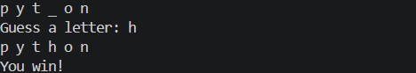

# 🎮 Hangman Game

A simple command-line Hangman game built in Python. The player has to guess the hidden word one letter at a time before running out of lives.

## 🚀 Features

* Randomly selects a word from a predefined list.
* Displays hidden letters using underscores.
* Allows the player to guess one letter at a time.
* Tracks already guessed letters.
* Input validation for invalid entries.
* Six lives for incorrect guesses.
* Displays a winning or losing message at the end of the game.

## 🛠️ Technologies Used

* Python 3
* Random Module

## 📂 Project Structure

```text
CodeAlpha_HangmanGame/
│── hangman_game.py
│── README.md
└── screenshots/
    ├── program_output.png
    └── game_win.png
```

## ▶️ How to Run

1. Clone this repository.
2. Open the project folder in your terminal.
3. Run the following command:

```bash
python hangman_game.py
```

4. Start guessing letters until you either reveal the entire word or run out of lives.

## 📸 Screenshots

### Program Output


### Winning the Game



## 👨‍💻 Author

**VIJAYASARATHY B**

GitHub: https://github.com/Vijay-1420
